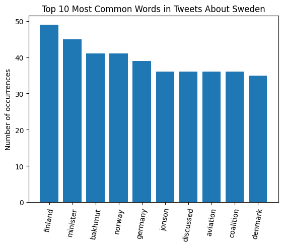
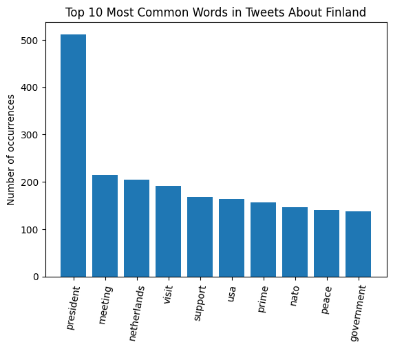

# An inquiry into Twitter trends during the Ukraine war


## Background

A year and a half ago, Sweden and Finland were aggressively pursuing NATO membership, a response to the war in Ukraine. They had initially intended to join the treaty together, but diplomatic obstacles hindered Sweden's approval. Finland's government then decided to continue to pursue membership independently of Sweden. The countries ended up joining the treaty together, so the story ends happily. But it got me thinking, were there differences in public opinion on the two countries during these proceedings?


## Research Question

My research question is: **What can Tweets about the Ukraine war that mention Sweden and/or Finland tell us about differences in public opinion on the two countries?**


## Data Gathering

I performed a data-driven inquiry into Twitter activity with reference to the Ukraine war, using a publicly available dataset on Kaggle. The source claims to "contain tweets monitoring the current ongoing Ukraine-Russia conflict." By using this data, I am assuming that the datasets used are a representative sample of tweets regarding the war in Ukraine.

First, I downloaded all available data gathered during the May 2022 and imported it into a Pandas DataFrame. I printed the columns of the DataFrame in order to better understand what information I could use to answer my questions.

```
> print(df.columns)

Index(['index', 'userid', 'username', 'acctdesc', 'location', 'following',
       'followers', 'totaltweets', 'usercreatedts', 'tweetid',
       'tweetcreatedts', 'retweetcount', 'text', 'hashtags', 'language',
       'coordinates', 'favorite_count', 'is_retweet', 'original_tweet_id',
       'original_tweet_userid', 'original_tweet_username',
       'in_reply_to_status_id', 'in_reply_to_user_id',
       'in_reply_to_screen_name', 'is_quote_status', 'quoted_status_id',
       'quoted_status_userid', 'quoted_status_username', 'extractedts'],
      dtype='object')
```

We can see that each row is one Tweet, and the columns of that row include information like tweetid, text, and favorite_count. I then formulated a set of more specific questions aimed at answering my two research questions, aiming to ask questions that I could answer using the available data. The following questions would guide the rest of my data analysis process:

1. **What percentage of Ukraine-discussion tweets mention Sweden? ... mention Finland?**
2. **What countries are these Tweets being posted from?**
3. **How many *favorites* do Tweets about Sweden or Finland get?**
4. **How many *retweets* do Tweets about Sweden or Finland get?**
5. **What are the most common keywords in Tweets mentioning Sweden? ... mentioning Finland?**
6. **What is the sentiment distribution in Tweets mentioning Sweden? ... mentioning Finland?**


## Analysis

### Question 1: What percentage of Ukraine-discussion tweets mention Sweden? ... mention Finland?

I separated all rows in the DataFrame into four categories: mentions Sweden, mentions Finland, mentions both, or mentions neither. I used the sizes of the four respective categories to compute each's fraction of the total dataset:

```
fraction of tweets mentioning sweden: 0.000199666533938147
fraction of tweets mentioning finland: 0.004586592736498698
fraction of tweets mentioning both: 5.852294960256032e-05
```


Firstly, we can see that less than 1% of all tweets about the Ukraine war mention either Sweden or Finland. These two countries are clearly not dominating the Twitter conversation about the Ukraine war.

We can also see that Finland's share of the conversation is nearly 23 times the size of Sweden's share of the conversation. Tweets mentioning Finland only account for nearly 95% of all Tweets mentioning either country. Finland is a much more popular topic in Tweets about the war.

Finally, we see that very few Tweets mention both countries, although it does occur from time to time.

### Question 2: What countries are these Tweets being posted from?

In order to determine each Tweet's origin country, I used the "location" column in the DataFrame. Location is not constrained or standardized as far as I could tell, so in order to answer this question, I had to solve the sub-problem of how to find a corresponding country name given a city, region, or country name.

GeonamesCache is a great Python library that "provides functions to retrieve names ... continents, countries as well as US states and counties." I used this library to write several functions, including, most importantly,

```
def get_country_from_string(string: str, countries_list: list, states_list: str, countries_dict: dict) -> str:
    """Given an input string, return the associated country code if country can be found."""
```

I processed all location names using my `get_country_from_string`, then computed its efficacy. Using GeonamesCache, I was able to resolve 80% of the location strings to a country. It is reasonable that some location strings could not be resolved, since locations included `Somewhere in the world`, `Over at the Frankenstein Place` and many other joke locations.

Using the new country location data, I performed frequency analysis on the countries and found the top 10 locations from which Tweets about each country were posted.


The USA and India are in top 10s of both countries, which makes sense because they are high-population countries. Interestingly, one of the most common origins of tweets about Sweden is Sweden. This could suggest that Sweden is a bigger topic domestically than it is internationally.

### Question 3: How many *favorites* do Tweets about Sweden or Finland get?

The majority of tweets regarding Sweden/Finland have no favorites. This suggests that the majority of these tweets have a fairly low impact; i.e. few users are saving these tweets in order to return to them later. However, Sweden has slightly more tweets with a favorite count than Finland does. The distributions of the two topics' favorite counts are shown below.


### Question 4: How many *retweets* do Tweets about Sweden or Finland get?

Tweets regarding Finland are retweeted more than tweets regarding Sweden. Finland tweets' median retweet count is 40, while Sweden tweets' median retweet count is 1. The vast majority of tweets about Sweden have very few retweets, while Finland shows steady retweet activity between 100-500 tweets. By contrast, there were no tweets regarding Sweden that got more than 100 retweets. The data is shown in the graphs below.


Based on this data, it is clear that tweets about Finland are shared more and make it further from the original tweet poster than do tweets about Sweden.

### Question 5: What are the most common keywords in Tweets mentioning Sweden? ... mentioning Finland?




### Question 6: What is the sentiment distribution in Tweets mentioning Sweden? ... mentioning Finland?


